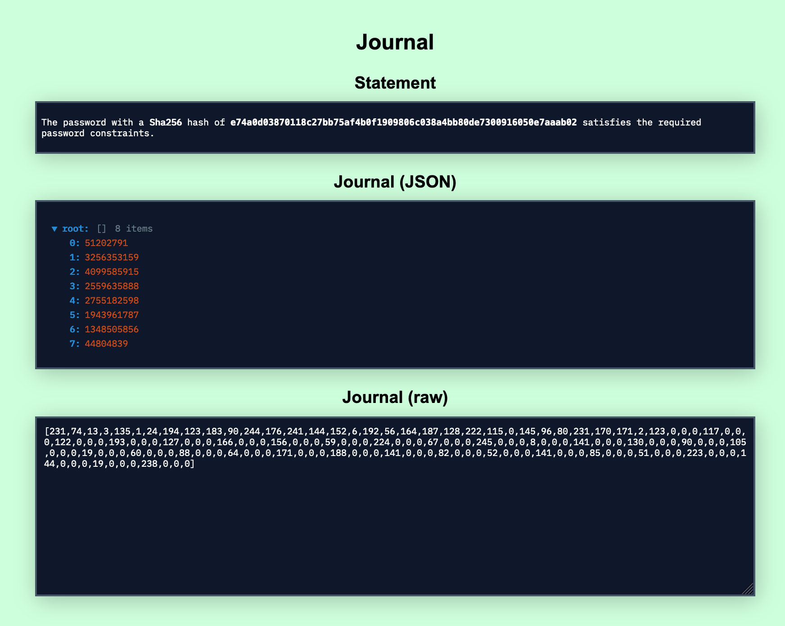

# RISC Zero zkVM Receipt Verifier

This is a verifier for [RISC Zero zkVM](https://dev.risczero.com/api/zkvm/) execution receipts.

It also has the ability to dynamically load custom parsers for the receipt journal data, see the [journal parsers](#journal-parsers) section.

# Hosted site
There is a web app [hosted here](https://risc0.verify.eqtylab.io/). You can run also it yourself with the command `make start-web` (See the requirements section).

## Try it out
[Here's an example receipt file](readme-assets/example-receipt.bin) that you can use. Select the "password-checker" guest code id from the list. This should successfully verify and you should see the journal contents displayed.

Or use your own receipt file in [bincode](https://docs.rs/bincode/latest/bincode/) or JSON format, along with the guest code id that generated it (but journal contents won't be displayed unless there's a parser registered, see the journal parser section below),

# npm packages
There are two npm packages that you can use. They can be installed from npm, or to build them yourself see the requirements section.

1. [Verifier React component](https://www.npmjs.com/package/@eqty/risc-zero-verifier-react). Usage docs [here](https://github.com/eqtylab/risc-zero-verifier/blob/main/react/README.md)
2. [Verifier with no UI](https://www.npmjs.com/package/@eqty/risc-zero-verifier) - built using [RISC Zero's rust verifier](https://docs.rs/risc0-zkvm/0.20.1/risc0_zkvm/struct.Receipt.html#method.verify) compiled to WASM. Usage docs [here](https://github.com/eqtylab/risc-zero-verifier/blob/main/wasm/README.md)

# Requirements
To build and run this yourself (to self host or to customize the components) you will need:

1. [Rust](https://www.rust-lang.org/) (tested with rust toolchain v1.76.0)
2. [wasm-pack](https://rustwasm.github.io/)
3. [Node.js](https://nodejs.org/en) (tested with v21.5.0)
4. [yarn](https://yarnpkg.com/) JS package manager (tested with 1.22.19)

Within this repo the npm packages are shared using [workspaces](https://yarnpkg.com/features/workspaces) rather than fetched from the npm repository.

To build everything do `make all` at the root of the project.

# Journal parsers
A RISC Zero program can publicly commit to data which goes into the receipt journal. The journal data is just bytes and there's no generic way to parse it without knowing the structure, but the program author can publish a WASM package that parses it, which this verifier can use dynamically.

The author of the program must implement a simple interface (two functions), publish the module using 
[IPFS](https://ipfs.tech/), and add it to [the registry](https://github.com/eqtylab/risc-zero-verifier/blob/main/journal-parser-registry/) via a pull request on this repo. 

If the parser is published on IPFS, and in the registry, then the verifier automatically finds it based on the guest code id and uses it to display the journal output. 

The output is displayed as a json tree, and optionally in a customizable format using markdown.

## Implementing a custom parser

### Parser interface
The author creates a WASM module with two public functions:

1. `json_obj_from_journal_bytes(journal: Vec<u8>) -> Result<JsValue, JsValue>`: returns a JSON object with the journal contents.
2. `statement_from_journal_bytes(journal: Vec<u8>) -> Result<JsValue, JsValue>`: returns a markdown-formatted string, e.g. a description of the execution including details from the journal.

See [this example](https://github.com/eqtylab/risc-zero-verifier/blob/main/examples/password-checker/journal-parser/src/lib.rs) for more info.

### Publishing the parser
Using IPFS guarantees that the code cannot be changed after publishing because IPFS content is found based on it's [CID](https://docs.ipfs.tech/concepts/content-addressing/) (or content ID, which is based on the content’s cryptographic hash).

To build and publish the parser:
1. [Install IPFS](https://docs.ipfs.tech/install/command-line/#install-official-binary-distributions)
1. Build a WASM package using the `web` target: `wasm-pack build --target web`.
2. Publish the output (the `pkg` directory) to IPFS. With a local IPFS use `ipfs add -r --cid-version=1 pkg` but be aware that you'll need to keep the content [pinned](https://docs.ipfs.tech/concepts/persistence/) either with a pinning service or your own server for it to remain accessible.
3. Add it to [the registry](https://github.com/eqtylab/risc-zero-verifier/blob/main/journal-parser-registry/) by submitting a PR on this repo.

Note that you'll need to do this again each time the guest code id changes.
